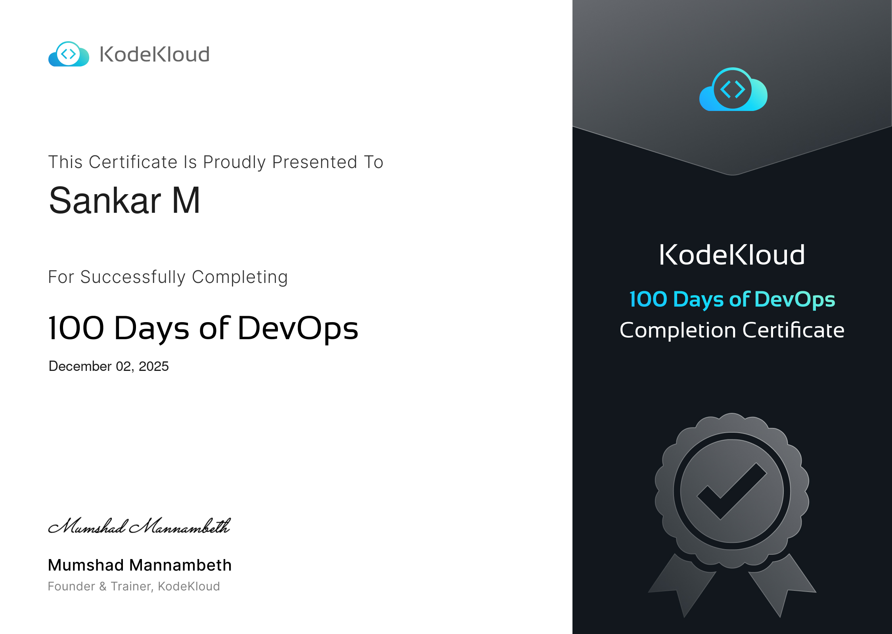

  

# 100 Days of DevOps – KodeKloud Tasks

This repository documents my journey through the **100 Days of DevOps Challenge by KodeKloud**, completed on **December 02, 2025**.

The challenge covered practical, real-world DevOps tasks across Linux, Git, Docker, Kubernetes, Jenkins, Ansible, Terraform, CloudWatch, and AWS services.  
I completed all **100 hands-on tasks**, strengthening my skills in automation, cloud operations, and CI/CD.

---

## 🏅 Certificate

Successfully completed **KodeKloud – 100 Days of DevOps**  
Date: **December 02, 2025**

---

## 🔧 Tech Stack & Tools Covered

- Linux Administration  
- Git & GitHub  
- Docker & Docker Compose  
- Kubernetes (Deployments, Pods, Volumes, Secrets, RBAC, Rolling Updates)  
- Jenkins (CI/CD, Pipelines, Jobs, Plugins, Slave Nodes)  
- Ansible (Playbooks, Inventories, Modules, Templates)  
- Terraform (VPC, EC2, IAM, DynamoDB, CloudWatch Alarms)  
- NGINX, Apache, PHP-FPM, Tomcat  
- MySQL, MariaDB, Redis, PostgreSQL  
- Monitoring & Cloud (AWS)

---

## 📅 Task List (100 Days)

Each task is listed with the day and topic.  
Full detailed list is available inside this repository.

---

## 📂 Repository Link

👉 https://github.com/Sankar-018/kodekloud-tasks

---

## 📈 What I Gained

- Strong command over DevOps tooling  
- Hands-on experience with cloud-native workflows  
- End-to-end implementation capability  
- Confidence in real-time troubleshooting  
- Skills aligned with modern DevOps & SRE roles.
